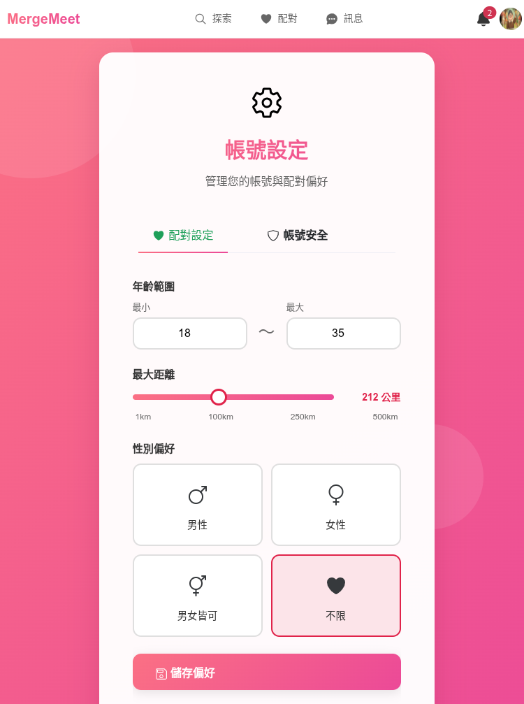
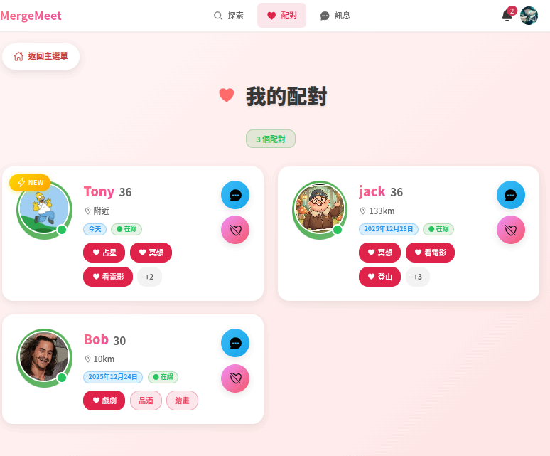
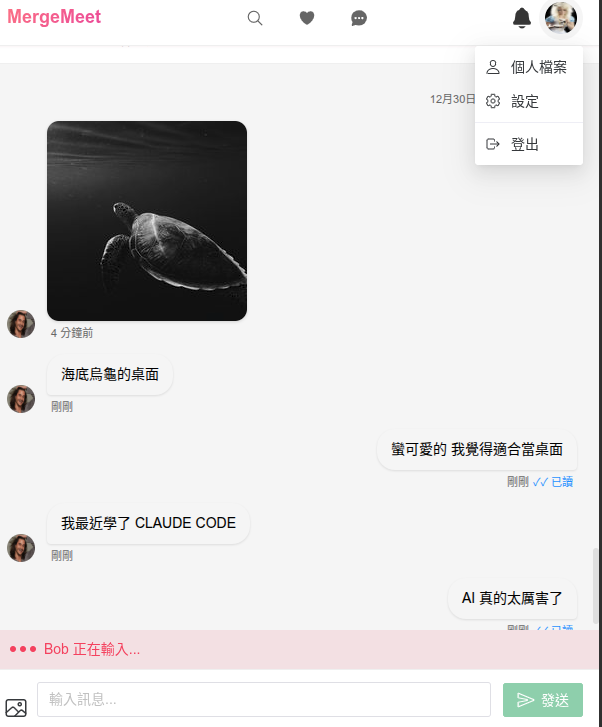
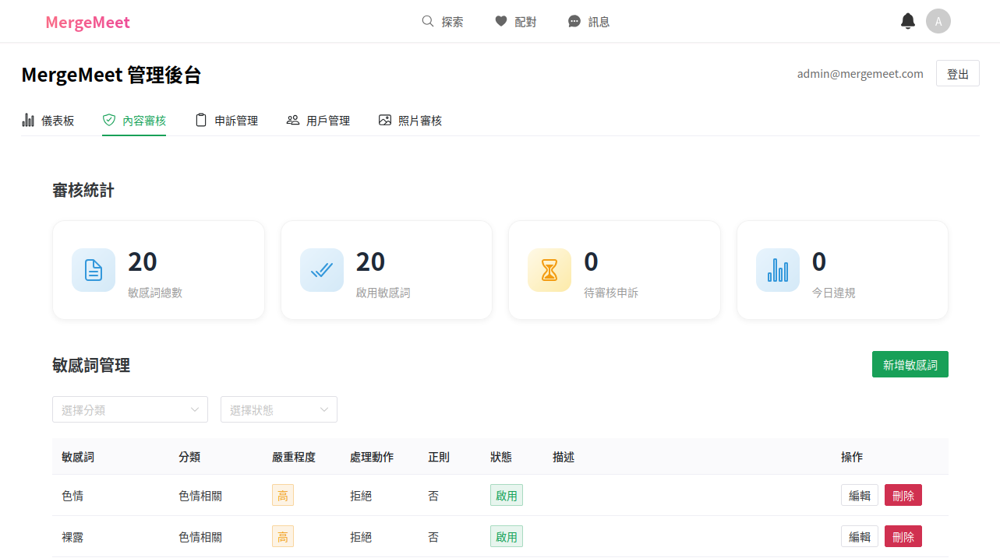

# 🎉 MergeMeet 交友平台

[](https://www.python.org/)
[](https://fastapi.tiangolo.com/)
[](https://vuejs.org/)
[](https://vite.dev/)
[](https://pinia.vuejs.org/)
[](https://nodejs.org/)
[](https://www.postgresql.org/)
[](https://postgis.net/)
[](https://redis.io/)
[](https://developer.mozilla.org/en-US/docs/Web/API/WebSockets_API)
[](https://www.docker.com/)

交友平台 MVP - FastAPI + Vue 3 + PostgreSQL + PostGIS

* [Youtube Tutorial - Claude Code 寫 4 萬行交友軟體 配對演算法怎麼做](https://youtu.be/ebrpVisRAPQ)

**特色**：智能配對推薦 ｜ 信任分數機制 ｜ 即時聊天 ｜ Claude Code 整合開發

## 📋 專案資訊

| 項目 | 說明 |
|------|------|
| **版本** | 1.0.0 MVP |
| **開發進度** | ✅ Week 1-6 已完成 |
| **代碼規模** | 純程式碼約 30,716 行（後端 6,504 + 前端 17,194 + 測試 7,018），含空行和註釋共 44,146 行 |

### 技術棧

| 層級 | 技術 | 版本 |
|------|------|------|
| **後端** | Python / FastAPI / SQLAlchemy 2.0 Async | 3.13+ |
| **前端** | Vue 3 / Composition API | 3.5.x |
| **路由** | Vue Router | 5.0.x |
| **狀態管理** | Pinia | 3.0.x |
| **建置工具** | Vite | 8.0.x |
| **UI 框架** | Naive UI | 2.44.x |
| **資料庫** | PostgreSQL + PostGIS | 17 |
| **快取** | Redis | 8.x |
| **即時通訊** | WebSocket | - |

## 📸 畫面截圖


首頁


配對頁面


帳號設定



配對列表




聊天與通知



管理後台



## 🚀 快速開始

### 前置需求

- Docker & Docker Compose
- Python 3.13+
- Node.js 24+

### 手動設置

#### 1. 啟動基礎服務

```bash
docker compose up -d
```

啟動 PostgreSQL、Redis 和 Mailpit

#### 2. 設置後端

```bash
cd backend

# 建立虛擬環境
python3 -m venv venv
source venv/bin/activate

# 安裝依賴
pip install -r requirements.txt
pip install -r requirements-test.txt
pip install -r requirements-dev.txt   # 開發工具（Ruff, pre-commit）

# 安裝 Git pre-commit hooks（首次設置）
pre-commit install

# 複製環境變數（已預設開發環境密碼 mergemeet123）
cp .env.example .env

# 執行資料庫遷移（建立表結構）
alembic upgrade head

# 初始化興趣標籤（新環境首次設置時執行）
python scripts/init_interest_tags.py

# 啟動後端
uvicorn app.main:app --reload
```

#### 3. 設置前端

```bash
cd frontend

# 安裝依賴
npm install

# 啟動前端
npm run dev
```

#### 4. 訪問應用

- 前端: http://localhost:5173
- 後端: http://localhost:8000

## 🧪 測試

```bash
cd backend && pytest -v --cov=app    # 後端測試
cd frontend && npm run test          # 前端測試
```

- 後端測試: 389 個（覆蓋率 >80%）
- 前端測試: 89 個（Vitest）

## 📊 專案結構

```text
mergemeet/
├── backend/                  # 後端 FastAPI 應用
│   ├── app/
│   │   ├── api/              # API 路由
│   │   ├── core/             # 核心配置 (config, security, database)
│   │   ├── models/           # SQLAlchemy 模型
│   │   ├── schemas/          # Pydantic Schemas
│   │   ├── services/         # 業務邏輯
│   │   ├── websocket/        # WebSocket 管理
│   │   └── main.py           # 主應用
│   ├── alembic/              # 資料庫遷移
│   ├── tests/                # pytest 測試
│   ├── uploads/              # 檔案上傳
│   └── scripts/              # 初始化腳本
│
├── frontend/                 # 前端 Vue 3 應用
│   └── src/
│       ├── views/            # 頁面組件
│       ├── components/       # 共用組件
│       ├── stores/           # Pinia Stores
│       ├── composables/      # Vue Composables
│       ├── api/              # API 客戶端
│       ├── utils/            # 工具函數
│       └── router/           # Vue Router
│
├── docs/                     # 專案文檔
└── docker-compose.yml        # Docker 配置
```

## 🔧 開發工具

| 工具 | 網址 | 說明 |
|------|------|------|
| API 文檔 (Swagger) | http://localhost:8000/docs | REST API 互動式文檔 |
| Mailpit | http://localhost:8025 | Email 測試工具（查看驗證碼、密碼重置連結等） |

**pgAdmin（資料庫管理）**：預設未啟用，需在 `docker-compose.yml` 中取消 pgadmin 服務的註解後執行 `docker compose up -d`

### 程式碼品質工具

commit 時會透過 pre-commit 自動執行以下檢查：

| 工具 | 範圍 | 功能 |
|------|------|------|
| [Ruff](https://docs.astral.sh/ruff/) | 後端 | Python linter + formatter（取代 flake8/black/isort） |
| [ESLint](https://eslint.org/) | 前端 | Vue/JS 程式碼品質檢查 |
| [Prettier](https://prettier.io/) | 前端 | 程式碼格式化 |

```bash
# 手動執行全部檢查
pre-commit run --all-files

# 單獨執行
ruff check backend/             # 後端 lint
ruff format backend/             # 後端 format
cd frontend && npx eslint src/   # 前端 lint
cd frontend && npx prettier --write src/  # 前端 format
```

## 🤖 AI 輔助開發

本專案使用 [Claude Code](https://claude.ai/code) 進行開發，提供以下 Skills：

| Skill | 用途 |
|-------|------|
| [`mergemeet-quickstart`](.claude/skills/mergemeet-quickstart/) | 開發環境設置與故障排除 |
| [`backend-dev-fastapi`](.claude/skills/backend-dev-fastapi/) | 後端開發模式（FastAPI + SQLAlchemy） |
| [`frontend-dev-vue3`](.claude/skills/frontend-dev-vue3/) | 前端開發模式（Vue 3 + Pinia） |
| [`api-routing-standards`](.claude/skills/api-routing-standards/) | API 路由規範（禁止尾隨斜線） |
| [`project-audit`](.claude/skills/project-audit/) | 專案健康檢查 |

> 詳見 [CLAUDE.md](./CLAUDE.md)

## 📝 核心功能

| 模組 | 功能 |
|------|------|
| **認證系統** | 註冊、登入、Email 驗證、密碼重置、JWT Token |
| **個人檔案** | 資料管理、照片上傳（6張）、興趣標籤、地理位置 |
| **探索配對** | Tinder 風格卡片、按鈕與鍵盤快捷鍵操作、5 維度配對演算法 |
| **即時聊天** | WebSocket、圖片訊息、已讀回條、打字指示器 |
| **安全功能** | 封鎖、舉報、內容審核、信任分數系統 |
| **管理後台** | 統計儀表板、舉報管理、用戶管理 |
| **通知系統** | 通知中心、未讀計數、即時推送 |

→ [功能清單詳細文檔](./docs/FEATURES.md)

## 🧠 技術特色

### 配對演算法

5 維度智能配對系統，綜合評估興趣匹配（50%）、地理距離（20%）、活躍度（20%）、檔案完整度（5%）和信任分數（5%），為用戶推薦最適合的對象。

| 維度 | 權重 | 說明 |
|------|------|------|
| 興趣匹配 | 50% | 每個共同興趣 10 分，最高 50 分 |
| 地理距離 | 20% | 使用 PostGIS 計算，越近分數越高 |
| 活躍度 | 20% | 根據最後上線時間評分 |
| 檔案完整度 | 5% | 照片數量 + 自我介紹 |
| 信任分數 | 5% | 用戶信譽評分 |

→ [配對演算法詳細文檔](./docs/MATCHING_ALGORITHM.md)

### 信任分數系統

自動追蹤用戶行為的信譽機制，獎勵正向互動、限制違規用戶，確保平台健康安全。

- **正向行為加分**：Email 驗證 +5、被喜歡 +1、配對成功 +2
- **負向行為扣分**：舉報確認 -10、違規內容 -3、被封鎖 -2
- **自動限制**：低信任用戶（< 20 分）每日訊息上限 20 則，配對曝光降低

→ [信任分數系統詳細文檔](./docs/TRUST_SCORE_SYSTEM.md)

## 📚 文檔

### 核心系統

| 文檔 | 說明 |
|------|------|
| [技術架構](./docs/ARCHITECTURE.md) | 系統架構、資料庫設計、API 設計 |
| [安全機制](./docs/SECURITY.md) | 認證授權、資料保護、安全措施 |

### 功能與開發

| 文檔 | 說明 |
|------|------|
| [游標分頁](./docs/CURSOR_PAGINATION.md) | 分頁實作方式 |
| [測試指南](./docs/testing/TESTING_GUIDE.md) | 測試策略與執行方式 |
| [管理員設置指南](./docs/管理員設置指南.md) | 管理員帳號配置 |

## 📌 相關連結

- [FastAPI](https://fastapi.tiangolo.com/)
- [Vue 3](https://vuejs.org/)
- [Pinia](https://pinia.vuejs.org/)
- [SQLAlchemy](https://www.sqlalchemy.org/)

## 📄 授權

本專案為學習與開發用途

## Donation

文章都是我自己研究內化後原創，如果有幫助到您，也想鼓勵我的話，歡迎請我喝一杯咖啡 :laughing:

綠界科技ECPAY ( 不需註冊會員 )


[贊助者付款](http://bit.ly/2F7Jrha)

歐付寶 ( 需註冊會員 )


[贊助者付款](https://payment.opay.tw/Broadcaster/Donate/9E47FDEF85ABE383A0F5FC6A218606F8)

## 贊助名單

[贊助名單](https://github.com/twtrubiks/Thank-you-for-donate)
